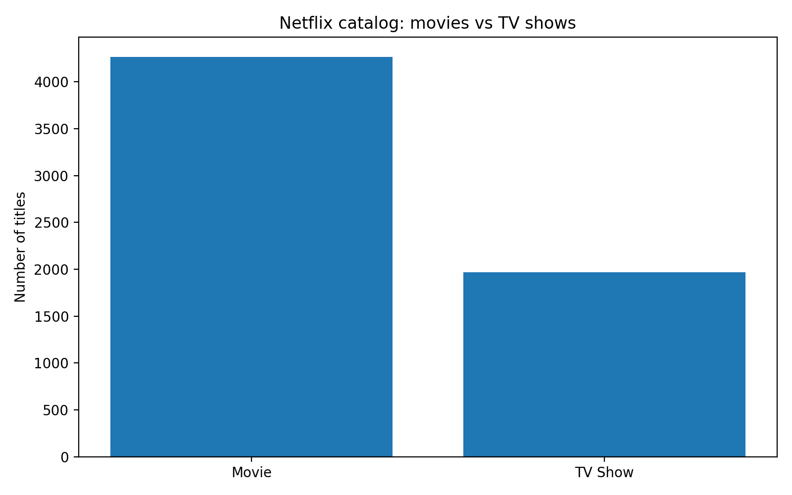
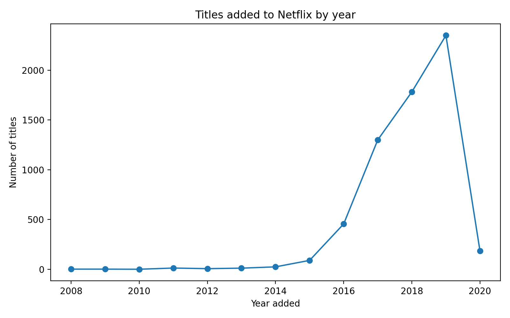
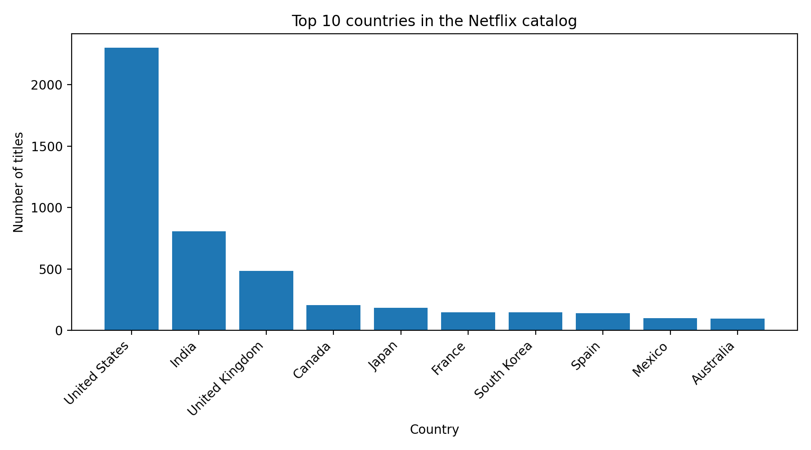
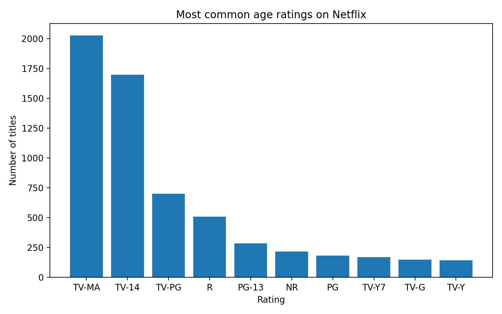
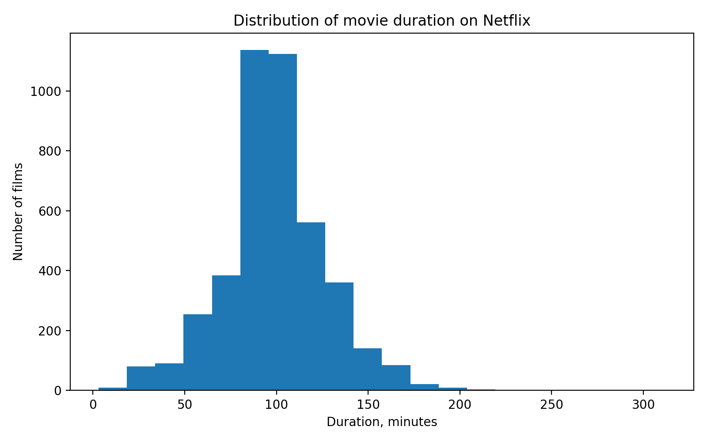

# Стриминговые платформы в медиакоммуникациях: кейс Netflix

## Синопсис
Этот проект посвящён теме стриминговых платформ в медиакоммуникациях на примере Netflix. Я выбрала эту тему, потому что стриминговые сервисы сегодня являются одной из самых заметных форм цифровых медиа. Через них пользователи смотрят фильмы и сериалы, а сами платформы влияют на то, какой контент становится более заметным.

В работе я использовала открытый датасет с фильмами и сериалами Netflix и на его основе провела небольшое data driven исследование. Проект включает сбор и подготовку данных, их очистку, базовый анализ, визуализацию результатов и публикацию материалов в GitHub-репозитории.

## Актуальность
Тема актуальна, потому что стриминговые платформы стали важной частью современной медиасреды. Они не только распространяют контент, но и формируют медиапотребление, то есть предлагают пользователям определённые форматы, жанры и типы контента.

На примере каталога Netflix можно посмотреть, какой контент преобладает на платформе, какие страны чаще представлены в библиотеке и на какую аудиторию ориентированы фильмы и сериалы. Это позволяет рассматривать Netflix не просто как сервис с видео, а как медиаплатформу, которая влияет на культурное потребление.

## Исследовательские вопросы
1. Что преобладает в каталоге Netflix: фильмы или сериалы?
2. Какие страны представлены в каталоге чаще всего?
3. Как менялось количество тайтлов, добавляемых на платформу по годам?
4. Какие возрастные рейтинги встречаются чаще всего?
5. Какой фильм можно считать типичным по длительности?

## Данные
Для проекта использован открытый датасет **Netflix Titles**. В нём содержатся данные о фильмах и сериалах, размещённых на платформе Netflix: название, тип контента, страна, дата добавления, год релиза, возрастной рейтинг, длительность и жанровая категория.

Файлы проекта находятся в папке [`data/`](data/):
- [`data/netflix_titles_raw.csv`](data/netflix_titles_raw.csv) — исходные данные;
- [`data/netflix_titles_clean.csv`](data/netflix_titles_clean.csv) — очищенные данные;
- [`data/summary_statistics.csv`](data/summary_statistics.csv) — основные статистические показатели;
- [`data/top_countries.csv`](data/top_countries.csv) — данные по странам;
- [`data/top_genres.csv`](data/top_genres.csv) — данные по жанрам;
- [`data/top_ratings.csv`](data/top_ratings.csv) — данные по возрастным рейтингам;
- [`data/titles_by_year_added.csv`](data/titles_by_year_added.csv) — данные по годам добавления;
- [`data/netflix_media_project_workbook.xlsx`](data/netflix_media_project_workbook.xlsx) — рабочая таблица для просмотра в Excel или загрузки в Google Таблицы.

### Сбор и очистка данных
В процессе подготовки данных были выполнены следующие действия:
- удалены дубликаты;
- проверены форматы столбцов;
- дата добавления приведена к единому формату;
- выделен отдельный столбец `year_added`;
- выделена основная страна производства (`main_country`);
- выделен основной жанр (`genre_main`);
- из столбца `duration` отдельно извлечено числовое значение;
- пропуски в отдельных столбцах были сохранены или обработаны в зависимости от их значения для анализа.

Таким образом, в проекте есть и исходные данные, и очищенная версия, что соответствует требованиям задания.

## Анализ
После очистки данных был проведён базовый анализ в формате, подходящем для Google Таблиц и учебного исследования.

### 1. Соотношение фильмов и сериалов
Всего в датасете **6234** тайтла. Из них:
- **4265** — фильмы;
- **1969** — сериалы.

Получается, что фильмы составляют **68,4%**, а сериалы — **31,6%**. Это показывает, что в данном наборе данных каталог Netflix в большей степени ориентирован на фильмы.



### 2. Динамика добавления контента
По годам видно, что особенно заметный рост количества добавляемых тайтлов начинается после 2016 года. Наибольшее количество добавлений в данном датасете приходится на **2019 год**.

Это можно связать с активным расширением платформы и увеличением объёма библиотеки в конце 2010-х годов.



### 3. Страны-производители
Чаще всего в каталоге встречаются следующие страны:
1. **United States** — 2302 тайтла;
2. **India** — 808;
3. **United Kingdom** — 483.

Можно сделать вывод, что наиболее заметную роль в библиотеке Netflix играют США, Индия и Великобритания.



### 4. Возрастные рейтинги
Среди возрастных рейтингов чаще всего встречаются:
- **TV-MA** — 2027;
- **TV-14** — 1698;
- **TV-PG** — 701.

Это показывает, что значительная часть контента ориентирована на подростковую и взрослую аудиторию.



### 5. Длительность фильмов
Средняя длительность фильма в датасете составляет **99,1 минуты**, а медианная — **98 минут**. Это значит, что типичный фильм в каталоге Netflix по длительности близок к стандартному полному метру.



## Ключевые выводы
По результатам анализа можно сделать следующие выводы:
1. В каталоге Netflix преобладают фильмы, а не сериалы.
2. Наиболее часто представлены США, Индия и Великобритания.
3. Самый заметный рост пополнения каталога наблюдается в 2017–2019 годах.
4. Большая часть контента рассчитана на подростковую и взрослую аудиторию.
5. Типичная длительность фильма составляет около 100 минут.

## Визуализации
В проекте использованы следующие типы визуализаций:
- круговая диаграмма;
- столбчатые диаграммы;
- график динамики по годам;
- гистограмма распределения.

Все изображения находятся в папке [`visualizations/`](visualizations/).

## Референсы
- датасет **Netflix Titles** из открытого доступа;
- учебные материалы по Google Таблицам;
- примеры оформления data-проектов на GitHub;
- материалы по теме стриминговых платформ и цифровых медиа.

## Инструменты
- **Google Таблицы** — для просмотра и базовой работы с данными;
- **Excel (.xlsx)** — для хранения рабочей таблицы;
- **Python (pandas, matplotlib)** — для дополнительной обработки данных и построения графиков;
- **GitHub** — для публикации проекта;
- **Markdown** — для оформления `README.md`.

## Структура репозитория
```text
netflix-media-project/
├── data/
│   ├── netflix_titles_raw.csv
│   ├── netflix_titles_clean.csv
│   ├── netflix_media_project_workbook.xlsx
│   ├── summary_statistics.csv
│   ├── top_countries.csv
│   ├── top_genres.csv
│   ├── top_ratings.csv
│   └── titles_by_year_added.csv
├── visualizations/
│   ├── 01_type_distribution.png
│   ├── 02_titles_by_year_added.png
│   ├── 03_top_countries.png
│   ├── 04_top_ratings.png
│   ├── 05_movie_duration_hist.png
│   └── 06_workbook_analysis_sheet_preview.png
├── scripts/
│   └── clean_and_analyze.py
└── README.md
```
